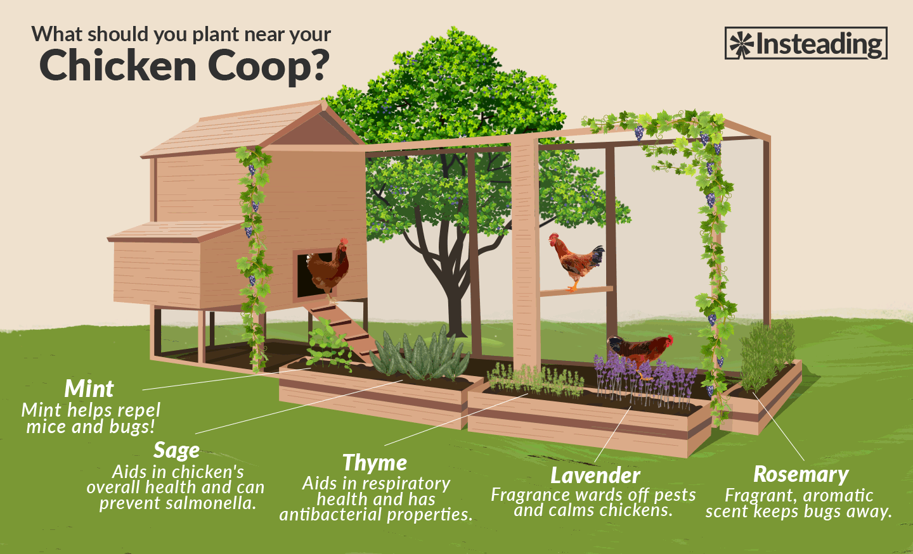
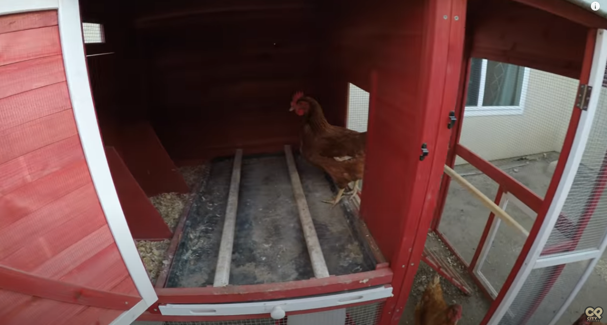
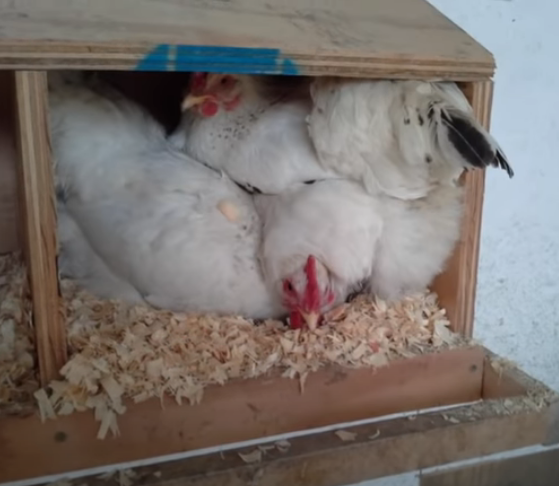
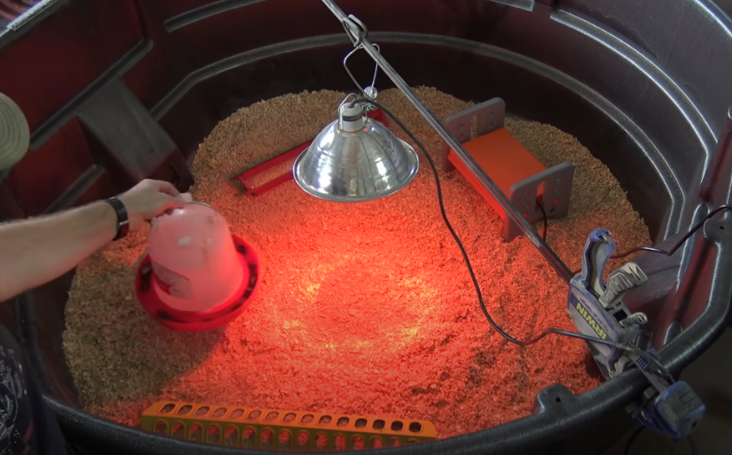
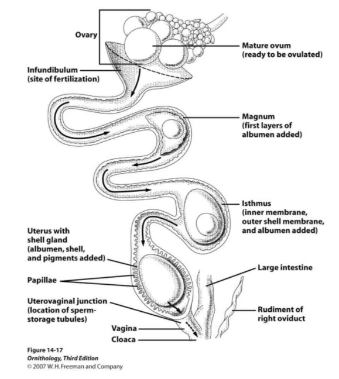
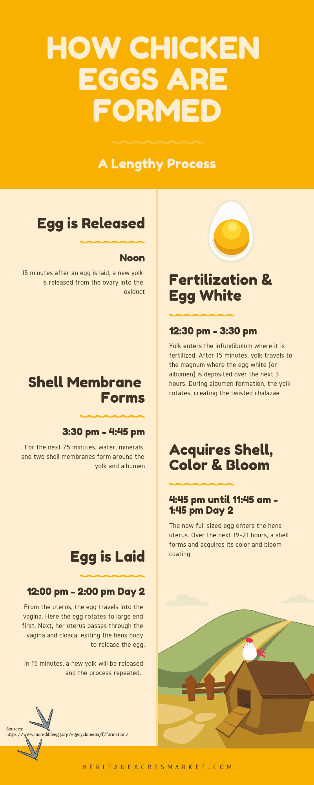
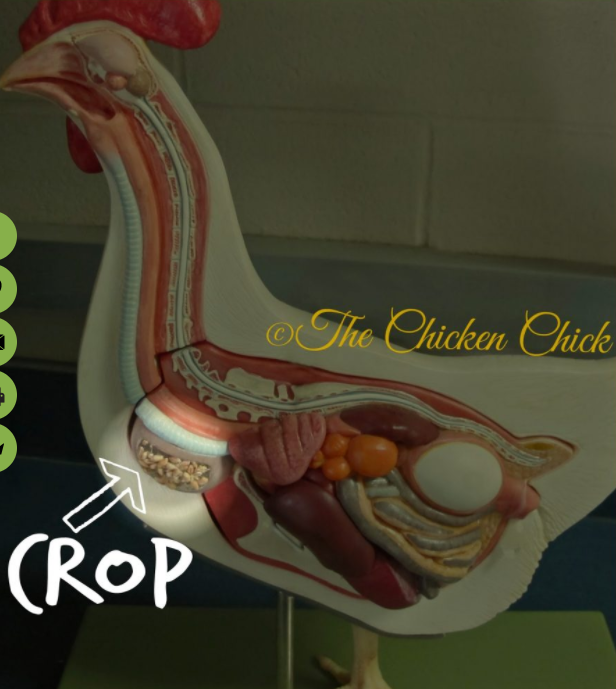

# The Chicken Manual

*v2*  

Easy – they pretty much take care of themselves. Your job as a bird keeper is to protect your birds.

[Habitat](#Habitat) | [Behavior](#Behavior) |  [Hygiene](#Hygiene) |  [Eggs](#Eggs) | [Images](#Images) | [Sources](#Sources)

## Habitat

* Temp: 45-85 F
* Sqft/hen: 2-3 (inside coop) /  8-10 (outside run)

A chicken **coop** is a shelter. It isn’t used so much to keep the birds in as it is to keep predators out, and to protect the birds from the elements. A chicken coop should have a roost, sufficient ventilation, and nesting boxes.

A **chicken run** is the fenced in area around the coop. Chickens run around in a chicken run. Wire should cover from above (raptor attacks or climbing predators) and well below (burrowing predators). Example predators: hawks, cats, dogs, raccoons, possums, coyotes, skunks.

The chicken run should have dirt and hay, things for chickens to dig or scratch at. Dust should be available for dust baths.

Low, covered spaces are great for shade for hot days or rainy days. They may lay eggs there.

Use vertical spaces, especially within the coop, to maximize habitat space efficiency. Chickens sleep high up. To prevent a chicken from roosting on a surface and pooping below, the surface should roll or otherwise be unstable.

Keep watering sources elevated above dirt to prevent chickens from digging dirt into them.

Chickens like to share a **nesting box**. One box can be used by a small flock. They are typically only used to lay eggs in; typically hens lay their eggs in the same place. Nesting boxes should contain nesting material such as wood shavings.

Check city ordinances on chicken keeping. Familiarize yourself with local vendors that service the agricultural community.

[National Poultry Improvement Plan (NPIP)](http://www.poultryimprovement.org/default.cfm)

## Behavior

Chickens will eat weed and grass clippings. Easy eaters; do not feed them chicken, they will eat. You can also purchase organic chicken feed. A full grown chicken might require 1 - 1.5 cups of feed per day.

Chickens love eating worms / caterpillars, and other bugs.

Can drink from water nipples.

Chickens can put themselves away at night (**free range**).

Pecking orders are natural group behavior, but excessive pecking may be indicative of overcrowding or poor living conditions.

Chickens sleep standing up (**roosting**).

Chickens can cohabitate with rabbits or ducks. Note that chicken and duck habitats are somewhat distinct.

Chickens can overheat easily (they are birds). They require access to fresh water.

## Hygiene

Chickens **molt** – lose feathers during seasonal change. Feathers are made of keratin, which is a protein.

Attract mice and rats, which chickens will eat, but shouldn’t; you need a rodent predator or control mechanism.

Chickens produce (a lot) of (non-pungent) biowaste that must be cleaned out. It is compostable.

Chickens can develop eye problems from pests (diatomaceous earth can aide).

Dust baths helps to prevent lice / mites / ticks (chicken pests do not transmit to humans).

**Sour crop** – a yeast infection of the crop (an internal organ, a pouch at the base of neck that holds food, water, and grit; not the waddle, which is the flaps of skin below the beak). Characterized by a large, swollen crop that feel like a water balloon, and a sour smell emanating from the bird’s mouth.

### Potentially fatal conditions

The conditions require attention and must be treated promptly.

* Bumblefoot - a type of staph infection in the foot pad.
* Pasty butt - when poop sticks to down (chicks) and blocks ventral functioning.

## Eggs

Types of egg laying breeds:

- Production Reds
- Australorps
- Leghorns
- Buff Orpingtons
- Easter Eggers
- Rhode Island Red

Begin laying eggs from about 6 months old (16-24 weeks).

Lay about 1 egg a day  (5/week) for year 1-2, then less and less each year after. Younger hens or overfed hens may lay 2 eggs a day.

Hens lay less or not at all during winter. Reduced sunlight decrease hormone and egg production levels. Feed should contain 15-18% protein.

Blood in a chicken egg is likely a ruptured blood vessel in the oviduct. Eggs are laid from that **cloaca**, the also opening for reproduction and waste elimination.

If you treat illnesses with antibiotics, do not eat eggs for a few weeks.

Chickens lay eggs without a rooster. A rooster will fertilize eggs.

The older the egg, the easier it is to peel. Do not hard boil an egg that is less than a week old.

## Images

  
A prefabricated chicken coop with a roll out tray for biowaste management underneath the roosting poles.

  

Chickens and chicks in a chicken run eating vegetative clippings. Note wire of the chicken run in background and the raised watering sources.

  
A chicken run with wire running deep underground to prevent entry by burrowing predators.

  
A chicken molting

  
Several chickens in a nesting box.

  
Chickens roosting on suspended rods.

  
A chick brooder with a suspended heat lamp. Note the specialized feeder at the bottom and the marble/gravel in the water source (holding).

  
> *"Physiologically speaking, it takes time to lay an egg. Eggs start in the ovary, much like humans. During ovulation, a yolk is released into the oviduct. The yolk moves through the oviduct, where it is fertilized (if a rooster is present) and the egg white (or albumen) is deposited. As the egg moves into the uterus, the yolk is encapsulated in the shell, the shell is colored, and the bloom adhered. The egg then continues through the uterus to be laid. This entire process takes 24-26 hours."*  
(Gennetta 2020)

  
Note the waddle under the beak.

---
---
---

## Sources

* Casey, Marya. 13 Beneficial Chicken-Friendly Plants To Grow Next To Coops. https://insteading.com/blog/chicken-friendly-plants/. Jan 15 2021.
* City Prepping. How to raise chickens in your backyard (10 tips). https://www.youtube.com/watch?v=8G8cH740_TQ. Oct 14, 2017.
* Gennetta, Nicole.
  * Common Chicken Terms. https://www.heritageacresmarket.com/common-poultry-terms/.  Dec 26, 2017.
  * How Many Eggs Does A Chicken Lay A Day. https://www.heritageacresmarket.com/how-many-eggs-does-a-chicken-lay-a-day/.  Jan 23, 2020.
* Hobby Farm Nutt. Raising chickens 101, getting started & what they don’t tell you. https://www.youtube.com/watch?v=1rDArRNSDBE. Aug 2, 2017.
* Mormino, Kathy Shea. Chiecken Anatomy: The Crop, Impacted Crop and Sour Crop. https://the-chicken-chick.com/chicken-anatomy-crop-impacted-crop-sour/. Est 2019.
* Stoney Ridge Farmer. Raising Chickens 101 Best advice and education you’ll find anywhere on the web. https://www.youtube.com/watch?v=MeDatQTO-V4. May 10, 2020.

## Working notes

---

Stoney ridge farmer

Hatchery

Mobile coops

Pens

Brooder – a safe warm place (85-100 F). Food waste is a problem with baby chicks.

Specialized feeders prevent chicks from scraping at food with claws or pooping in feed. Marbles or other forms of displacement can be used to prevent chicks from entering water sources and drowning.

Laying hen house

Meat bird (a **broiler** is a chicken raised specifically for meat production)

Patriculture

Cornish cross bird / Rainbow ranger
Hens can eat weeds out of a garden
