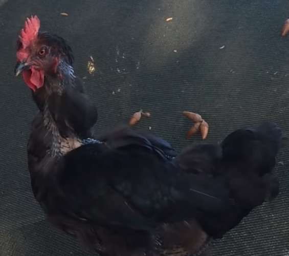
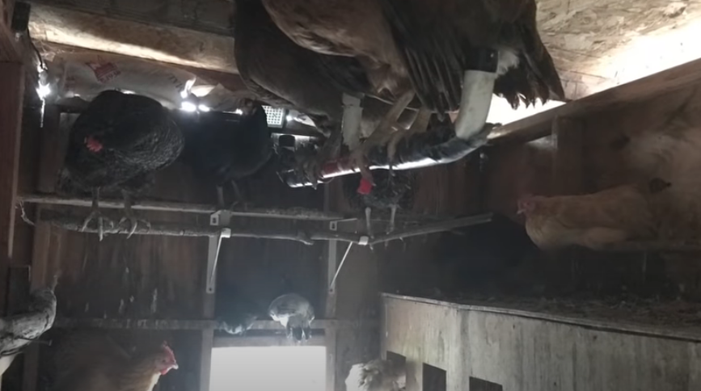

# The Chicken Manual
*v2*  
Easy – they pretty much take care of themselves.  
Your job as a bird keeper is to protect your birds.

* [Habitat](#Habitat)
* [Behavior and hygiene](#Behavior-and-hygiene)
* [Eggs](#Eggs)
* [Sources](#Sources)

## Habitat

A chicken **coop** is a shelter. It isn’t used so much to keep the birds in as it is to keep predators out, and to protect the birds from the elements. A chicken coop should have a roost, sufficient ventilation, and nesting boxes.

A **chicken run** is the fenced in area around the coop. Chickens run around in a chicken run. Wire should cover from above (raptor attacks or climbing predators) and well below (burrowing predators). Example predators: hawks, cats, dogs, raccoons, possums, coyotes, skunks.

The chicken run should have dirt and hay, things for chickens to dig or scratch at. Dust should be available for dust baths.

Low, covered spaces are great for shade for hot days or rainy days. They may lay eggs there.

Use vertical spaces, especially within the coop, to maximize habitat space efficiency. Chickens sleep high up. To prevent a chicken from roosting on a surface and pooping below, the surface should roll or otherwise be unstable.

Keep watering sources elevated above dirt to prevent chickens from digging dirt into them.

Chickens like to share a **nesting box**. One box can be used by a small flock. They are typically only used to lay eggs in; typically hens lay their eggs in the same place. Nesting boxes should contain nesting material such as wood shavings.

Chickens space requirements:
* 2-3 sqft (inside chicken coop)
* 8-10 sqft (outside run)

Check city ordinances on chicken keeping. Familiarize yourself with local vendors that service the agricultural community.

## Behavior and hygiene

Chickens will eat weed and grass clippings. Easy eaters; do not feed them chicken, they will eat. You can also purchase organic chicken feed. A full grown chicken might require 1 - 1.5 cups of feed per day.

Chickens love eating worms / caterpillars, and other bugs.

Can drink from water nipples.

Dust baths helps to prevent lice / mites / ticks (chicken pests do not transmit to humans).

Chickens can put themselves away at night (**free range**).

Chickens **molt** – lose feathers during seasonal change.

Pecking orders are natural group behavior, but excessive pecking may be indicative of overcrowding or poor living conditions.

Chickens sleep standing up (**roosting**).

Chickens can cohabitate with rabbits or ducks. Note that chicken and duck habitats are somewhat distinct.

Chickens can overheat easily (they are birds). They require access to fresh water.

Attract mice and rats, which chickens will eat, but shouldn’t; you need a rodent predator or control mechanism.

Chickens can develop eye problems from pests (diatomaceous earth can aide).

Chickens produce (a lot) of (non-pungent) biowaste that must be cleaned out. It is compostable.

## Eggs

Begin laying eggs from about 6 months old.

Lay about 1-2 egg a day for their first year, then less and less each year after.

Blood in a chicken egg is likely a ruptured uterine blood vessel.

If you treat illnesses with antibiotics, do not eat eggs for a few weeks.

Chickens lay eggs without a rooster. A rooster will fertilize eggs.

The older the egg, the easier it is to peel. Do not hard boil an egg that is less than a week old.

## Sources

Hobby Farm Nutt. Raising chickens 101, getting started & what they don’t tell you. https://www.youtube.com/watch?v=1rDArRNSDBE. Aug 2, 2017.

Stoney Ridge Farmer. Raising Chickens 101 Best advice and education you’ll find anywhere on the web. https://www.youtube.com/watch?v=MeDatQTO-V4. May 10, 2020.

Gennetta, Nicole. How Many Eggs Does A Chicken Lay A Day. https://www.heritageacresmarket.com/how-many-eggs-does-a-chicken-lay-a-day/.  Jan 23, 2020. 

City Prepping. How to raise chickens in your backyard (10 tips). https://www.youtube.com/watch?v=8G8cH740_TQ. Oct 14, 2017.

##Images

A prefabricated chicken coop with a roll out tray for biowaste management underneath the roosting poles.

Chickens and chicks in a chicken run eating vegetative clippings. Note wire of the chicken run in background and the raised watering sources.

A chicken run with wire running deep underground to prevent entry by burrowing predators.

A chicken molting

Several chickens in a nesting box.

Chickens roosting on suspended rods.

A chick brooder with a suspended heat lamp. Note the specialized feeder at the bottom and the marble/gravel in the water source (holding).

---
---
---

## Working notes

---

Stoney ridge farmer 

Hatchery

Mobile coops

Pens

Brooder – a safe warm place (85-100 F). Food waste is a problem with baby chicks. 

Specialized feeders prevent chicks from scraping at food with claws or pooping in feed. Marbles or other forms of displacement can be used to prevent chicks from entering water sources and drowning.

Laying hen house

Meat bird

Patriculture

Cornish cross bird / Rainbow ranger

Hens can eat weeds out of a garden.

---